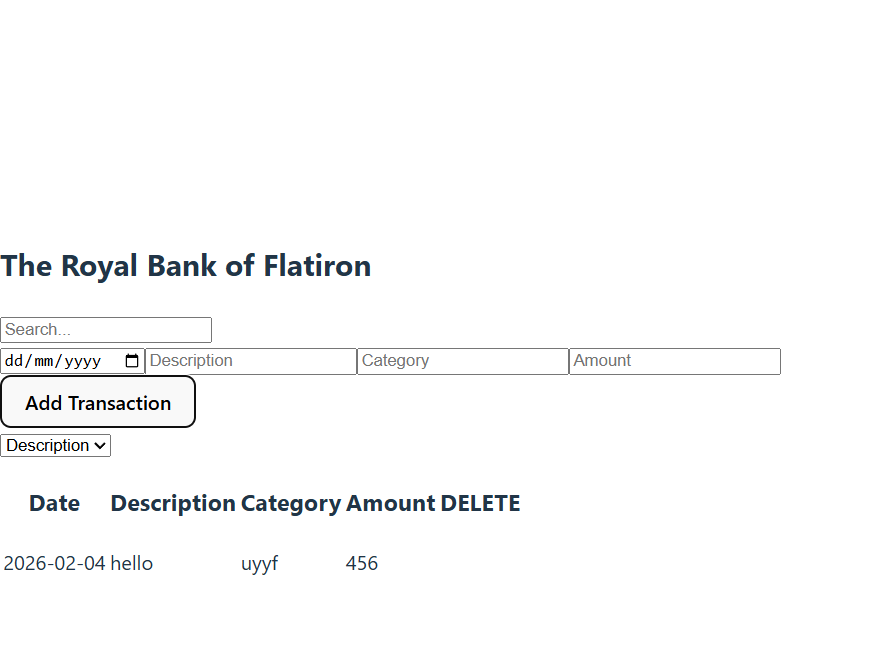

# Royal Bank of Flatiron — Transaction Tracker

## Description

Royal Bank of Flatiron is a React-based banking interface that allows users to track their expenditures by viewing, adding, searching, and sorting transactions. The project demonstrates integration between a frontend React application and a mock backend API, with a full Vitest testing suite to ensure reliability.

This project focuses on **test-driven development (TDD)** principles and iterative refinement using Vitest and React Testing Library.

---

## Features

* Display transactions on application startup
* Add new transactions to the ledger
* Search transactions dynamically
* Sort transactions by category or description
* Mock backend powered by json-server
* Automated test coverage using Vitest

---

### 3. Install testing dependencies (if not already installed)

```bash
npm install -D vitest @testing-library/react @testing-library/jest-dom jsdom
```

---

## Running the Application

### Start the frontend

```bash
npm run dev
```

### Start the backend (json-server)

```bash
npm run server
```

The app will typically run at:

* Frontend: http://localhost:5173
* Backend: http://localhost:6001

---

## Running Tests

Run the Vitest suite:

```bash
npx vitest
```

## Test Coverage

The project includes test suites for:

### Display Transactions

* Verifies transactions render on startup
* Confirms data is fetched from backend

### Add Transactions

* Verifies new transactions appear in UI
* Confirms POST request is triggered

### Search and Sort

* Verifies search input updates displayed results
* Confirms filtering logic works correctly

## Usage Example

1. Launch the app
2. View existing transactions
3. Add a new transaction using the form
4. Use the search bar to filter results
5. Sort transactions using the sort control


## screenshot 
